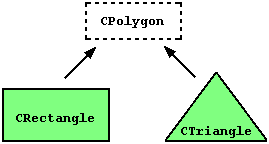

# Introduction - C++ classes

All the code that you will find in ROOT, AliRoot and AliPhysics is written in the form of C++ *classes*. A class is a data type which is defined by the user, and allows for creating data members and functions specific for that class. By convention, each class in AliPhysics, AliRoot, and ROOT, is stored in its own **header** (.h) and **implementation** file, which have the same name as the class it defines (so later on, we will see that your analysis class, stored in a file 'AliAnalysisTaskMyTask', is called 'AliAnalysisTaskMyTask'). 


If you have never heard of classes (or C++), it might be a good idea to go through a C++ manual, an excellent one, with plenty of hands-on examples, can be found here: [http://www.cplusplus.com/doc/tutorial/](http://www.cplusplus.com/doc/tutorial/). 


Classes are extended structures which contain both **variables** and **functions** (which are called **methods**) as **members**. Often, variables must be **accessed** through these methods. This might sound a bit abstract, but it becomes much more clear when you look at in a small code example:

```cpp
    class Rectangle
    {
     private:
      int width, height;
     public:
      Rectangle(int,int);
      int GetArea() {return height * width;}
    }
```
Here we defined a class, called **Rectangle**, which has variables **width** and **height**, and a **method** called `GetArea` which gives us access to the members. 

### Inheritance

Classes are nice and important, because they can be **derived** from one-another (a feature called **inheritance**. Look at the figure below 




In this figure, `Rectangle` is **derived** from **base** class `Polygon`, and *inherits* its members. If we want to define a second class, `Triangle`, which is also a polygon and will therefore have features in common with `Rectangle`, we can also derive it from base class `Polygon`. This  avoids having to **repeat** common code for multiple which share features. 


Classes are very powerful, but inheritance can sometimes make it tricky to understand how code is structured!


Let's take a look at how our classes would look like when we put them down as C++ code. First, we define out base class, the polygon

```cpp
class Polygon
{
 private:
  int width, height;
}
```
This example lives in 2-dimensional space, so our polygon is fully defined by its width and its height. The two polygons that we want to define, are a rectangle and a triangle. The rectangle can be defined as follows

```cpp
    class Rectangle : public Polygon
    {
     public:
      Rectangle(int,int);
      int GetArea() {return height * width;}
    }
```

Note that we **do not** have to define the members `height` and `width` here, as they are already defined in our base class! The only *method* that is specific to the rectangle, is the `GetArea` method. 

Our triangle class can be written as

```cpp
    class Triangle : public Polygon
    {
     public:
      Triangle(int,int);
      int GetArea() {return (height * width)/2;}
    }
```
 
Again, `width` and `height` are defined in the base class `Polygon`, but also the Triangle class gets its own `GetArea` method. So now we have seen how **inheritance** makes our classes (and our life) simpler: by defining common functionality in a base class, we avoid *repetition* of code, which could easily lead to mistakes.



Inheritance is used widely in C++ code, and therefore also in AliROOT and AliPhysics. Take a look at the `AliMCEvent` class below
```cpp
    class AliMCEvent : public AliVEvent {
      public:
      ....
      private:
      ....
    }
```
Here `AliMCEvent` is derived from its base class `AliVEvent`, in the same way as the `Triangle` is derived from the base class `Polygon`. Classes such as `AliESDEvent` and `AliAODEvent` are also derived from `AliVEvent`, preventing a lot of *boilerplate* (i.e. needlessly repetitive) code.



C++ classes are, in code bases, usually split into a *header* file (extention .h) and an implementation file (extension .cxx). A header file is generally used to define all of the functions, variables and constants contained in a class. There are multiple good reasons for splitting code into an implementation and a header - can you think of a few? 


# AliAnalysisTaskSE

Now that you are an expert at C++ classes, you might wonder why classes are relevant to writing an analysis task. The reason is the following: in the AliPhysics analysis framework, **all analysis tasks are derived from the same base class, called `AliAnalysisTaskSE`**, where SE stands for 'single event'. This class in turn, is derived from the class `AliAnalysisTask` (if you are interested, you can go through the code and follow the full chain of inheritance). 

Since all analysis tasks derive from `AliAnalysisTaskSE`, all analyses share the following common, base methods:

```cpp
        AliAnalysisTaskSE::AliAnalysisTaskSE();
        AliAnalysisTaskSE::AliAnalysisTaskSE(const char*);
        AliAnalysisTaskSE::~AliAnalysisTaskSE();
        AliAnalysisTaskSE::UserCreateOutputObjects();
        AliAnalysisTaskSE::UserExec(Option_t*);
        AliAnalysisTaskSE::Terminate(Option_t*);
```

These are methods that you will always need to implement. 

In the following section, we will go through these methods in detail.

## Class constructors and destructors

The functions

```cpp
        AliAnalysisTaskSE::AliAnalysisTaskSE();                 // class constructor
        AliAnalysisTaskSE::AliAnalysisTaskSE(const char*);      // class constructor
        AliAnalysisTaskSE::~AliAnalysisTaskSE();                // class destructor
```

are your class **constructors** and **destructor**. These are standard C++ features, that are called when you create or delete an instance of your class. We will later on see, why you need to define *two* different class constructors. 

## AliAnalysisTaskSE::UserCreateOutputObjects()

In this function, the user (i.e. the analyzer) can define the output objects of the analysis. These are e.g. histograms in which you store your physics results. These output objects can be attached to the output file(s) of the analysis. 


When you are designing your class for your analysis, it (obviously) pays off to think about which output you need to extract the physics; do you want ten 1D histograms, or will four 2D histograms supply much more information? Or would you prefer writing certain information to a TTree, such that you have full information available when post-processing on your laptop? All these different output objects bring memory and size considerations, so choose well.


## AliAnalysisTaskSE::UserExec()

This function is called *for each, single event* over which your analysis task runs. This function is your 'event loop'. Examples of useful things to do in the UserExec() function:
* Check if an event has properties that you want to have in your analysis, if not `return;`
* Access the physics objects specific to your analysis (e.g. the charged particles in this event, or find the highest momentum particle)
* Fill the histograms or other output objects



If the function `AliAnalysisTaskSE::SelectCollisionCandidates(UInt_t trigger_mask)` is called before you launch your analysis, `UserExec()` will only be executed for events which pass the trigger selection that you have specified. 


## AliAnalysisTaskSE::Terminate()

The `Terminate` function is called at the very end of the analysis, when all events in your input data have been analyzed. Often, you leave the `Terminate` function empty: usually it is more practical to write a small macro that performs post-processing on your analysis output files, rather than deferring this functionality to the `Terminate` function.   
