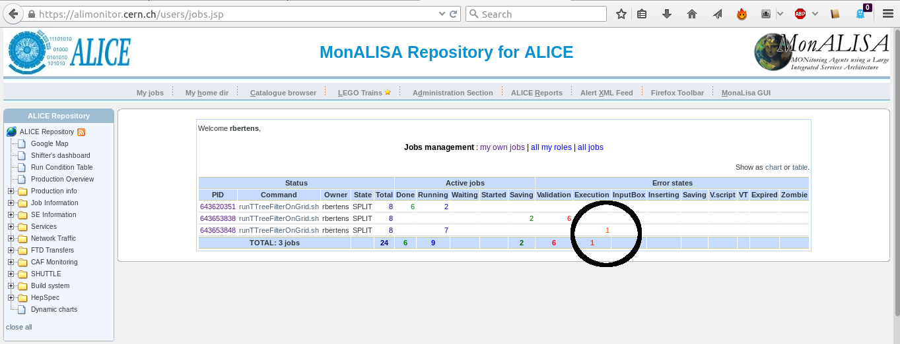

# How to write your analysis task for AliPhysics

The basic goal of this introduction is to explain to you how you can *write* and *run* a minimal analysis task for the AliPhysics analysis framework. This task will not give you any real 'physics' results, it's just a minimal example of what you need to do a data analysis for the ALICE experiment. 

At the end of this introduction, you will *understand* what happens in your analysis task, and you will understand how to run it on your laptop, on the Grid, and in 'LEGO-trains', what all of this means will become clear later on. After you have read this introduction, you can follow steps 1 through 6, which will give you hands-on experience with building an analysis from the grounds up, and running it. These steps will require you to have access to a working AliPhysics build, to obtain this, see [this ref|this ref]. 

## Introduction - a few words on C++ classes

All the code that you will find in ROOT, AliRoot and AliPhysics is written in the form of C++ *classes*. A class is **put definiiton here** . By contention, each class in AliPhysics, AliRoot, and ROOT, is stored in an independent file, which has the same name as the class it defines (so later on, we will see that your analysis class, stored in a file 'AliAnalysisTaskMyTask', is called 'AliAnalysisTaskMyTask'). If you have never heard of classes (or C++), it might be a good idea to go through the C++ manual, which you can find here
.... here the link to the c++ manual .... and covers everything there is to know about C++, from the basics to more advanced topics. 

Classes are extended structures which contain both *variables* and *functions*, which are called *methods* as members. Often, variables must be *accessed* through these methods. This might sound a bit abstract, but it becomes much more clear when you look at in a small code example:

```cpp
    class Rectangle
    {
     private:
      int width, height;
     public:
      Rectangle(int,int);
      int GetArea() {return height * width;}
    }
```
Here we defined a class, called *Rectangle*, which has variables *width* and *height*, and a *method* called `GetArea` which gives us access to (information related to) the members. 

Classes are nice and important, because they can be *derived* from one-another (a feature called *inheritance*. Look at the figure below 


In this figure, CRectangle is *derived* from *base* class CPolyogon, an *inherits* its members. If we want to define a second class, CTriangle, which is also a polygon and will therefore have features in common with CRectangle, we can also derive it from base class CPolyogon. This  avoids having to **repeat** common code for multiple which share features. 


Classes are very powerful, but inheritance can sometimes make it tricky to understand how code is structured!


Let's take a look at how our classes would look like when we put them down as C++ code. First, we define out base class, the polygon

```cpp
class Polygon
{
 private:
  int width, height;
}
```
This example lives in 2-dimensional space, so our polygon is fully defined by its width and its height. The two polygons that we want to define, are a rectangle and a triangle. The Rectangle can be defined as follows

```cpp
    class Rectangle : public Polygon
    {
     public:
      Rectangle(int,int);
      int GetArea() {return height * width;}
    }
```

Note that we **do not** have to define the members `height` and `width` here, as they are already defined in our base class! The only *method* that is specific to the rectangle, is the `GetArea` method. 

Our Triangle class can be written as

```cpp
    class Triangle : public Polygon
    {
     public:
      Triangle(int,int);
      int GetArea() {return (height * width)/2;}
    }
```
 
Again, `width` and `height` are defined in the base class `Polygon`, but also the Triangle class gets its own `GetArea` method. So now we have seen how **inheritance** makes our classes (and our life) simpler: by defining common functionality in a base class, we avoid *repetition* of code, which could easily lead to mistakes. 

# AliPhysics analysis tasks: common ingredients

Now that you are an expert at C++ classes, you might wonder why classes are relevant to writing an analysis task. In the AliPhysics analysis framework, all analysis tasks are derived from the same base class, called `AliAnalysisTaskSE`. 


All the analysis tasks in AliPhysics are derived from the base class `AliAnalysisTaskSE`, where SE stands for 'single event'. This class in turn, is derived from the class `AliAnalysisTask` (if you are interested, you can go through the code and follow the full chain of inheritance). 

Since all analysis tasks derive from `AliAnalysisTaskSE`, all analyses share the following common, base methods:

```cpp
        AliAnalysisTaskSE::AliAnalysisTaskSE();
        AliAnalysisTaskSE::AliAnalysisTaskSE(const char*);
        AliAnalysisTaskSE::~AliAnalysisTaskSE();
        AliAnalysisTaskSE::UserCreateOutputObjects();
        AliAnalysisTaskSE::UserExec(Option_t*);
        AliAnalysisTaskSE::Terminate(Option_t*);
```

These are methods that you will always need to implement. In the following section, we will explain all these methods in detail.


## Your analysis task: the header

As written before, 

We’ll use a **fixed format** for writing our class

-   The **header** file (.h) which contains function prototypes

-   The **implementation** file (.cxx), in which the code is implemented

-   An **AddTask.C** macro which creates an **instance** of your class
    and **configures** it

Let’s start by looking at our header, as here all functions are defined


```cpp
#ifndef AliAnalysisTaskMyTask_H
#define AliAnalysisTaskMyTask_H|\pause|
class AliAnalysisTaskMyTask : public AliAnalysisTaskSE  
{|\pause|
public:
   // two class constructors
   AliAnalysisTaskMyTask();
   AliAnalysisTaskMyTask(const char *name);|\pause|
   // class destructor
   virtual                 ~AliAnalysisTaskMyTask();|\pause|
   // called once at beginning of runtime
   virtual void            UserCreateOutputObjects();|\pause|
   // called for each event
   virtual void            UserExec(Option_t* option);|\pause|
   // called at end of analysis
   virtual void            Terminate(Option_t* option);|\pause|
ClassDef(AliAnalysisTaskMyTask, 1);
};

#endif
```

[Adding our histogram]{} Let’s start filling in the blanks, and add a
**histogram**, an **output list** and some more

-   Class members must be **defined** in the header
```cpp
    ...
    class AliAnalysisTaskMyTask : public AliAnalysisTaskSE
    ...
     private:
       AliAODEvent*  fAOD;           //! input event
       TList*        fOutputList;    //! output list
       TH1F*         fHistPt;        //! dummy histogram
    ...
```

-   Pointers to objects that are initialized at **run-time** (the
    **User...** methods) should have at the end - I’ll explain later

-   We use an output **list** to have one **common** output object,
    rather than many

[Implementation: AliAnalysisTaskMyTask.cxx]{}

-   ROOT requires **two** class constructors ... (we’ll get later to why
    this is necessary)

        AliAnalysisTaskMyTask::AliAnalysisTaskMyTask() : AliAnalysisTaskSE(), 
            fAOD(0), fOutputList(0), fHistPt(0)
        {
            // ROOT IO constructor, don't allocate memory here!
        }
        AliAnalysisTaskMyTask::AliAnalysisTaskMyTask(const char* name) : AliAnalysisTaskSE(name),
            fAOD(0), fOutputList(0), fHistPt(0)
        {
            DefineInput(0, TChain::Class()); 
            DefineOutput(1, TList::Class()); 
        }

-   In the constructor, we **initialize** members to their **default**
    values ...

-   ... and tell the task what the in- and output is

[Implementation: AliAnalysisTaskMyTask.cxx]{} Objects that are
**output** are initialized in the function

-   UserCreateOutputObjects()

```cpp
    ...
    #include "TList.h"
    #include "TH1F.h"
    ...
    AliAnalysisTaskMyTask::UserCreateOutputObjects()
    {
        // create a new TList that OWNS its objects
        fOutputList = new TList();
        fOutputList->SetOwner(kTRUE);
        |\pause|
        // create our histo and add it to the list
        fHistPt = new TH1F("fHistPt", "fHistPt", 100, 0, 100);
        fOutputList->Add(fHistPt);
        |\pause|
        // add the list to our output file
        PostData(1,fOutputList); 
    }
```

[The event loop]{} The function **UserExec()** is called for each event

-   This is the ‘heart’ of our analysis

```cpp
    ...
    #include "AliAODEvent.h"
    ...
    AliAnalysisTaskMyTask::UserExec(Option_t*)
    {
      // get an event from the analysis manager
      fAOD = dynamic_cast<AliAODEvent *>InputEvent();

      // check if there actually is an event
      if(!fAOD) return;
```

[The event loop]{} The function **UserExec()** is called for each event

-   This is the ‘heart’ of our analysis

```cpp
           ...
        if(!fAOD) return;
        // let's loop over the trakcs and fill our histogram
    |\pause|
        // first we get the number of tracks
        Int_t iTracks(fAOD->GetNumberOfTracks());
    |\pause|
        // and then loop over them
        for(Int_t i(0); i < iTracks; i++) {
            AliAODTrack* track = static_cast<AliAODTrack*>(fAOD->GetTrack(i));
            if(!track) continue;
            |\pause|
            // here we do some track selection
            if(!track->TestFilterbit(128) continue;
    |\pause|
            // fill our histogram
            fHistPt->Fill(track->Pt());
        }
        // and save the data gathered in this iteration
        PostData(1, fOutputList);
    }
```

In principe, this is all we need in the .cxx and .h

[Almost there: the AddTask macro]{} The **AddMyTask.C** macro
**instantiates** our task (class), define it’s in- and output and
connect it to the **analysis manager**

```cpp
AliAnalysisTaskMyTask* AddMyTask(TString name = "name") {
  AliAnalysisManager *mgr = AliAnalysisManager::GetAnalysisManager();
|\pause|
  TString fileName = AliAnalysisManager::GetCommonFileName();
  fileName += ":MyTask";      // create a subfolder in the file|\pause|
  // now we create an instance of your task
  AliAnalysisTaskMyTask* task = new AliAnalysisTaskMyTask(name.Data());   
  // add your task to the manager
  mgr->AddTask(task);|\pause|
  // connect the manager to your task
  mgr->ConnectInput(task,0,mgr->GetCommonInputContainer());
  // same for the output
  mgr->ConnectOutput(task,1,mgr->CreateContainer("MyOutputContainer", TList::Class(), AliAnalysisManager::kOutputContainer, fileName.Data()));|\pause|
  // important: return a pointer to your task
  return task;
}
```

that’s it\

{width=".3\textwidth"}\

now let’s **run** our class

[Running your task]{} Basically, there’s 3 options for running

-   Run on **local** data

-   Run on **GRID** (either in test or full mode) yourself

-   Run on GRID using the **LEGO** train system

There’s also **proof**, not covered in these slides, but your supervisor
might suggest it

Let’s take a look at running our task **on our own laptop**

-   So we have to **compile our code**

-   and launch our analysis

[Local testing: runAnalysis.C]{}

    void runAnalysis() {
        // header location
        gROOT->ProcessLine(".include $ROOTSYS/include");
        gROOT->ProcessLine(".include $ALICE_ROOT/include");|\pause|
        // create the analysis manager
        AliAnalysisManager *mgr = new AliAnalysisManager("AnalysisMyTask");
        AliAODInputHandler *aodH = new AliAODInputHandler();
        mgr->SetInputEventHandler(aodH);|\pause|
        // compile the class (locally)
        gROOT->LoadMacro("AliAnalysisTaskMyTask.cxx++g");
        // load the addtask macro
        gROOT->LoadMacro("AddMyTask.C");|\pause|
        // create an instance of your analysis task
        AliAnalysisTaskMyTask *task = AddMyTask();|\pause|
        // if you want to run locally, we need to define some input
        TChain* chain = new TChain("aodTree");
        chain->Add("/scratch/.../AliAOD.root");|\pause|
        // start the analysis locally
        mgr->StartAnalysis("local", chain);
    }

[Example: running it locally]{}

    [rbertens@degobah test]$ aliroot runAnalysis.C 

{width="\textwidth"}

time to try for yourself\
.\
.\
https://github.com/rbertens/ALICE\_analysis\_tutorial\
.\
..\
try steps 1, 2, and 3

coding conventions\
{width=".78\textwidth"}\

helping others understand your code

[Cleaning up and improving your code]{}

-   One of the most important things you can do is make sure your code
    is **readable**

-   This means using **whitespace** freely, **consistent indentation**,
    etc

-   This is **valid** C++ code:

    ``` {.numberLines .c language="C" numbers="left"}
    for(int i=0;i<10;i++){cout<<"i is "<<i<<endl;}
    ```

    but it looks **bad**

-   This is C++ code **equivalent** to that:

    ``` {.numberLines .c language="C" numbers="left"}
    for(int i=0; i<10; i++)
      {
        cout << "i is " << i << endl;
      }
    ```

    and it looks much **better**

-   There are no wrongs or rights, but be **consistent**

[Cleaning up and improving the code]{} Another very important thing to
do is build in **fault tolerance**

-   Check e.g. the snippet

    ``` {.numberLines .c language="C" numbers="left"}
    for(Int_t i(0); i < iTracks; i++) {
        // loop over all the tracks
        AliAODTrack* track = static_cast<AliAODTrack*>(fAOD->GetTrack(i));
        // fill our histogram
        fHistPt->Fill(track->Pt());
    }
    ```

-   We can build in fault tolerance:

    ``` {.numberLines .c language="C" numbers="left"}
    for(Int_t i(0); i < iTracks; i++) {
        // loop over all the tracks
        AliAODTrack* track = static_cast<AliAODTrack*>(fAOD->GetTrack(i));
        if(!track) continue;
        // fill our histogram
        fHistPt->Fill(track->Pt());
    }
    ```

[Cleaning up and improving the code]{}

-   Finally, it’s a very good idea to comment your code

-   Comments improve readability and maintainability

-   Comments should be useful, though, and comments that are overly
    obvious can be avoided\

    ``` {.numberLines .c language="C" numbers="left"}
    // no comment: bad
    a++;
    |\pause|
    // pointless comment, also not so good

    a++; // adding 1 to a

    |\pause|
    // descriptive comment, very good

    a++; // adding 1 to a to make a point during a tutorial
    ```

-   It’s also a good idea to document your code as you’re writing it -
    you **will** forget how it works and no-one will continue with
    uncommented tasks

### GRID

{width="\textwidth"}

### But then there is GRID

{width="\textwidth"}

[Running your task on GRID]{}

-   Set up the Alien Enviroment in **runAnalysis**

    ``` {.numberLines .c language="C" numbers="left"}
    // create and configure the plugin
    AliAnalysisAlien *alienHandler = new AliAnalysisAlien();
    // also specify the include (header) paths on grid
    alienHandler->AddIncludePath("-I. -I$ROOTSYS/include -I$ALICE_ROOT -I$ALICE_ROOT/include -I$ALICE_PHYSICS/include");
    // make sure your source files get copied to grid
    alienHandler->SetAdditionalLibs("AliAnalysisTaskMyTask.cxx AliAnalysisTaskMyTask.h");
    alienHandler->SetAnalysisSource("AliAnalysisTaskMyTask.cxx");
    // select the aliphysics version. all other packages
    // are LOADED AUTOMATICALLY!
    alienHandler->SetAliPhysicsVersion("vAN-20160330-2");
    // select the input data
    alienHandler->SetGridDataDir("/alice/data/2011/LHC11h_2");
    alienHandler->SetDataPattern("*ESDs/pass2/AOD145/*AOD.root");
    // MC has no prefix, data has prefix 000
    alienHandler->SetRunPrefix("000");
    // runnumber
    alienHandler->AddRunNumber(167813);
    ```

[Running your task on GRID]{}

-   ... continued ...

    ``` {.numberLines .c language="C" numbers="left"}
    // number of files per subjob
    alienHandler->SetSplitMaxInputFileNumber(40);
    alienHandler->SetExecutable("myTask.sh");
    // specify how many seconds your job may take
    alienHandler->SetTTL(10000);
    alienHandler->SetJDLName("myTask.jdl");
    |\pause|
    alienHandler->SetOutputToRunNo(kTRUE);
    alienHandler->SetKeepLogs(kTRUE);
    // merging: run with kTRUE to merge on grid
    // after re-running the jobs in SetRunMode("terminate") 
    // (see below) mode, set SetMergeViaJDL(kFALSE) 
    // to collect final results
    alienHandler->SetMaxMergeStages(1);
    alienHandler->SetMergeViaJDL(kTRUE);

    // define the output folders
    alienHandler->SetGridWorkingDir("myWorkingDir");
    alienHandler->SetGridOutputDir("myOutputDir");
    ```

[Test or full mode ? ]{}

-   The GRID analysis can run in **full** or **test** mode

        // connect the alien plugin to the manager
        mgr->SetGridHandler(alienHandler);
        if(gridTest) {
            // speficy on how many files you want to run
            alienHandler->SetNtestFiles(1);
            // and launch the analysis
            alienHandler->SetRunMode("test");
            mgr->StartAnalysis("grid");
        } else {
            // else launch the full grid analysis
            alienHandler->SetRunMode("full");
            mgr->StartAnalysis("grid");
        }

-   Test mode **simulates** a GRID environment locally for testing

-   Full mode launches your jobs to GRID

[Launching your task on GRID]{} Not different from local running, but
make sure you have a valid **token**

    [rbertens@degobah ~]$ alien-token-init rbertens
     ...
    => Trying to connect to Server [0] root://pcapiserv03.cern.ch:10000 as User rbertens 
    ...
    Creating token ..................................... Done
    Your token is valid until: Thu Apr  7 15:23:52 2016

and you’re good to go

    [rbertens@degobah test]$ aliroot runAnalysis.C 

In the end, you have still to **merge** your output to get it locally

### Merging output on GRID

The easiest way to merge your output is using the ‘MergeViaJDL’ option

[When you launch your jobs (in ‘runAnalysis.C’)]{}

    alienHander->SetMergeViaJDL(kTRUE);
    alienHander->SetMaxMergeStates(1);  // just one step
    ....
    mgr->SetRunMode("full");

[When all your jobs are in [done]{} [($\leftarrow$ never use green on
slides!)]{}]{}

    alienHander->SetMergeViaJDL(kTRUE);
    alienHander->SetMaxMergeStates(1);  // just one
    ....
    mgr->SetRunMode("terminate");

and run ‘runAnalysis.C’ again - this launches **merging** jobs\
$\longrightarrow$ *I’ll tell later where you can monitor the progress of
your jobs!*

### Merging output on GRID

When all your **merging** jobs are in [done]{}

[Retrieve the final output]{}

    alienHander->SetMergeViaJDL(kFALSE);
    alienHander->SetMaxMergeStates(1);  // just one
    mgr->SetRunMode("terminate");

and run ‘runAnalysis.C’ a final time

This will trigger

-   Downloading of the merged output files

-   A final ‘local’ merge of said files

When the process is **done** your high-statistics output files is ready

**caveat** - merging is ‘dumb’

-   files are kept in memory while merging

-   large outputs might need multiple stages

MonaLISA - the ALICE GRID monitoring toolset\
 \
{height=".3\textwidth"}
       {height=".3\textwidth"}\
 \
http://alimonitor.cern.ch/\
access with valid certificate and ALICE VO registration\
https://alien.web.cern.ch/content/vo/alice/userregistration

### Getting runnumbers from MonaLISA

{width="\textwidth"}

### Getting runnumbers from MonaLISA

{width="\textwidth"}\
check if your favorite **system** was taking **reliable** data!

### Getting runnumbers from MonaLISA

{width="\textwidth"}

### ... but then: which data to take ...?

You will find, for each run, data as

-   **AliESDs.root**: event summary data

-   **AliAOD.root**: analysis object data

in various **passes**\
**ESD** files contain **full** information about events

-   unless otherwise specified, use is **discouraged** as data are very
    large

**AOD** files contain information necessary for **physics analysis**

-   the preferred format for anaysis

-   **pre filtered** collections of tracks, to be selected via their
    filterbit\

**see previous talk!**\
**Passes**: over time we uderstand the experiment and data better

-   rule-of-thumb: take the **latest** (but discuss!)

### Available packages

only call ‘SetAliPhysicsVersion(“..”)’ in your run macro\
the right dependencies are automatically resolved
{width=".8\textwidth"}\
daily tags (AN) created at 16h ( available $\approx$2 hrs later)

### Run quota - how many jobs can you run?

if you’re over your quota, jobs won’t run\
{width=".8\textwidth"}\
be patient - quota are not all refreshed instantaneously (can take 12
hrs)

troubleshooting\
{width=".3\textwidth"}\
when GRID does not do\
what you want it to do

### First off all: be informed!

The GRID and its software are **complex**

-   and communicating problems with it is even complexer !

Subscribe yourself to the **analysis** mailings lists on
**e-groups.cern.ch**

-   alice-analysis-operations

-   alice-project-analysis-task-force

-   your PAG’s mailing list

We also have more professinal bug/feature tracking: **JIRA**

-   https://alice.its.cern.ch/jira/projects/ALPHY

-   **assigning** issues, **following** issues, making requests, etc

[Troubleshooting 101]{}

                `Dear experts,
            All my jobs are going into error. 
                Could you check? Thanks!'
            

The experts **can** (and probably will) check, but you yourself should
be the **first** to take a look

-   Go to ‘**my jobs**’ on MonaLISA

-   Take a look at the job **trace** and, if available, the **stderr**
    and **stdout**

If you cannot solve the issue: be complete in your message and **don’t
kill** your jobs!

Heads-up: excellent **actual debugging** documentation is available at

-   https://dberzano.github.io/alice/debug/

### Validation Error example

{width="\textwidth"}

### Validation Error example

{width="\textwidth"}

### Validation Error example

{width="\textwidth"}

### Validation Error example

{width="\textwidth"}

[and the patient suffers from ...]{} Segmentation violation means
**illegal memory** access

-   Either GRID is really broken (not so likely)

-   or I’m doing something wrong ... better check my pointers

    ``` {.numberLines .c language="C" numbers="left"}
    AliAnalysisTaskMyTask::UserCreateOutputObjects()
    {
        // create a new TList that OWNS its objects
        fOutputList = new TList();
        fOutputList->SetOwner(kTRUE);
        // add the list to our output file
        PostData(1,fOutputList);
    }
       ...
       fHistPt->Fill(track->Pt()); // segfault!
    ```

Turns out **fHistPt** is not initialized in my UserCreateOutputObjects()

-   Oops .. some more rigorous was apparantly required ...

### Execution Error example

{width="\textwidth"}

### Execution Error example

{width="\textwidth"}

### Execution Error example

{width="\textwidth"}\
... better search for **memory leaks** ... (see backup)

[What is the perfect workflow?]{} There is **no** perfect workflow - my
personal preference

-   Download some AliAOD.root files to your computer

-   Develop your task

-   Test locally (fast, no internet connection needed)

When this goes well

-   Check in ‘test’ grid mode. There are a few subtle differences
    between running LOCALLY and on GRID (which I’ll get to later)

If the code is robust:

-   Don’t spend long nights (re)submitting jobs to GRID ...

-   ... rather get your code checked into AliPhysics

-   **And use the LEGO trains**

back to our running task\
.\
.\
it’s now finished on GRID\
.\
.\
but how do you retrieve the output ?

some ROOT pitfalls\
{width="\textwidth"}\
\
`//! ... //-> ... //`

### In short

Strongly urged to use the LEGO train system

-   Easier for you (no submitting, merging, low quota, etc)

-   Better for GRID (less resource consumption)

-   Code in AliPhysics: science is open - your results are reproducable

So take a look at

-   https://indico.cern.ch/event/402639/contribution/3/attachments/806635/1105393/AnalysisTutorial.pdf

-   https://twiki.cern.ch/twiki/bin/viewauth/ALICE/AnalysisTrains

-   https://alimonitor.cern.ch/trains/

`dynamic memory`\
{width="\textwidth"}\
\
`and cleaning up`

### The ROOT Streamer

    `Dear experts,
            my task worked fine <enter_date> but now 
            on grid it does not. can you take a look ? '
            

Many weird errors are caused by misuse of the **ROOT’s Streamer** So
what is the ‘**streamer** to begin with?

-   The ROOT streamer **decomposes** an object into its data members
    (**serialization**) and writes it to disk

``` {.numberLines .c language="C" numbers="left"}
class Polygon
{
 private:
  int width, height;
}
```

Streamer’s job:

-   save value of height, width

[The automatically generated streamer]{} ROOT automaticaly generates a
steamer for us

-   In our task, we defined

          // tell ROOT the class version
          ClassDef(AliAnalysisMyTask,1);
        };
        #endif

-   which constructs a streamer using the `ClassDef` macro (it does much
    more, if you’re interested, see `$ROOTSYS/include/Rtypes.h`)

What we have to do: **customize** it

-   Customization means defining what data members **should** and
    **should not** be touched by the streamer

-   Customization is done in the **.h** of a class ...

-   ... in the **comments after** data members (i.e. ‘//’)

which (I personally) find easy to miss ...

### Customizing: ‘member persistence’

-   Persistent Members (//) are ‘streamed’ (copied/stored)

            class SomeClass : public TObject {
                private:
                   Int_t   fMinEta;     // min eta value
                   Int_t   fMaxEta;     // max eta value
                      ...
            

-   Transient Members (//!) are **not** streamed

            class SomeClass : public TObject {
                      ...
                   AliAODEvent*    fAOD;        //! current event
                   TH1F*           fHistPt;     //! our histogram
            

For these classes

-   fMinEta and fMaxEta will be stored (//)

-   fAOD and fHistPt will be ignored (//!)

### There is (always) more

-   The Pointer to Objects (//-$>$) calls streamer of the object
    directly

            class SomeClass : public TObject {
                private:
                   TClonesArray  *fTracks;            //->
                      ...
            

-   Variable Length Array, (so that not just the pointer is copied)

            class SomeClass : public TObject {
                      Int_t          fNvertex;
                      ...
                      Float_t       *fClosestDistance;   //[fNvertex]
            

All this is explained in **detail** in 11.3 of the ROOT documentation

-   https://root.cern.ch/root/htmldoc/guides/users-guide/ROOTUsersGuide.html\#streamers

[How can this go wrong?]{} If you run **locally**, your task is
(probably) never copied, ergo

-   The streamer information is never used

-   // and //! are equivalent

If you run on GRID/LEGO, the situation is different:

-   Your task is initialized **locally** and added to the **manager**

-   The manager is **stored** locally in a .root file

-   This file is **copied** to grid nodes, invoking the streamer

-   At the grid node, a ‘**fresh**’ instance of your task is created

-   Non-persistent members are initialized to their default values found
    in the **empty I/O constructor** (remember slides 9 and 10)

-   **Persistent** members are read from the .root file

Special care should **always** be taken with **pointer members**

[Example 1 - ‘unexpected’ behavior]{}

    class SomeClass : public TObject 
        Int_t   fAbsEta; //!
        // setter
        SetAbsEta(Float_t eta) {fAbsEta = eta;}
    |\pause|
        // ROOT IO constructor
    SomeClass::SomeClass() : 
    fAbsEta(0) {;}
    |\pause|
    // and you configure your task
    SomeClass->SetAbsEta(3);
       

after copying (e.g. to grid) fAbsEta = 0 !

    class SomeClass : public TObject 
        Int_t   fAbsEta; //
        // setter
        SetAbsEta(Float_t eta) {fAbsEta = eta;}
    |\pause|
        // ROOT IO constructor
    SomeClass::SomeClass() : 
    fAbsEta(0) {;}
    |\pause|
    // and you configure your task
    SomeClass->SetAbsEta(3);
            

after copying (e.g. to grid) fAbsEta = 3 !

[Example 2 - Common segfaults]{} Look at the functions of AnalysisTaskSE
and **when** they’re called

      // constructor: called locally
      AliAnalysisMyTask(const char*);
      // function called once at RUNTIME
      virtual void UserCreateOutputObjects();
      // functions for each event at RUNTIME
      virtual void UserExec(Option_t*);
        

**RUNTIME** is on GRID. Copying uninitialized objects will go wrong, so
generally, **pointers initialized at RUNTIME should be non-persistent**
(//!)

-   streaming un-initialized pointers leads to **segfaults**

-   Rule-of-thumb: for all your **output** histograms, use

                    TH1F*       fHistPt;        //! pt histo

-   and **initialize** your pointers to 0x0 in your constructors

### ‘Automatic Schema Evolution’

{width="\textwidth"}\

[‘Automatic Schema Evolution’]{}

       `The StreamerInfo of class AliAnalysisTaskMyTask
       has the same version (=1) as the active class but a 
       different checksum.  Do not try to write, ..., 
       the files will not be readable.'

If you **develop** your code, the layout of persistent members probably
changes

``` {.numberLines .c language="C" numbers="left"}
class Polygon
{
 private:
  int width;
}
```

size = 4 bytes

``` {.numberLines .c language="C" numbers="left"}
class Polygon
{
 private:
  int width, height;
}
```

size = 8 bytes

-   The **ClassDef value** bookkeeps this evolution for ROOT and avoids
    compatibility problems

### Upgrading the ClassDef() value

-   **Changing** the list of **persistent** members

            class SomeClass : public TObject {
                private:
                   Int_t   fAbsEta;     // min eta value
                      ...
            ClassDef(SomeClass, 1);
            

-   should lead to an **increase**

             class SomeClass : public TObject {
                private:
                   Int_t   fMinEta;     // min eta value
                   Int_t   fMaxEta;     // max eta value
                ...
            ClassDef(SomeClass, 2);
            

Memory layout changes: ClassDef should reflect this

### Upgrading the ClassDef() value

-   Changing the list of **non-persistent** members

            class SomeClass : public TObject {
                private:
                   Int_t   fAbsEta;     //! min eta value
                      ...
            ClassDef(SomeClass, 1);
            

-   does **not** change this

             class SomeClass : public TObject {
                private:
                   Int_t   fMinEta;     //! min eta value
                   Int_t   fMaxEta;     //! max eta value
                ...
            ClassDef(SomeClass, 1);
            

Memory layout does not change

[Scaling up]{} By now, your class is running well on GRID .... but do
you really want to

-   .... stay up all night to resubmit jobs?

-   .... lose your code when your laptop dies ?

****

So what we’ll do

-   Make your code available in AliPhysics

-   Use automatic GRID job submission via our LEGO train system

[Adding a class to AliPhysics]{} Two files to change

-   CMakeLists.txt

-   \*LinkDef.h

If you do this for the first time, ask your PWG or PAG coordinators for
help!

Once you’ve made the relevant changes to AliPysics, open a PR as Dario
explained about yesterday

[LEGO trains in a nutshell]{} Launching your job on GRID is (each
analysis task requires one instance of AliROOT running)

-   More efficient: add **many jobs** (wagons) of different users that
    require the same data to a single analysis manager (engine)

-   Run these in an **automated way** (train)

This is done in the **LEGO trains**
(https://alimonitor.cern.ch/trains/)\

{width="\textwidth"}

{width="\textwidth"}\

{width="\textwidth"}\

{width="\textwidth"}\

ok - more than enough\
we’ve seen:\
how to write a task\
how to run it\
and hopefully understand it\
.\
.\
.\
.\
is there still time .. ?

time to try for yourself\
.\
.\
https://github.com/rbertens/ALICE\_analysis\_tutorial\
.\
..\
try steps 4 and 5

### For our class

Out class dynamically allocates memory (use of the **new**)

        // create our histo and add it to the list
        fHistPt = new TH1F("fHistPt", "fHistPt", 100, 0, 100);
        

This has 3 implications:

-   After usage, **we** are resonsible for freeing the allocated memory
    (else it’s **lost**!)

-   A bit more advanced: you have to think about the copy constructor
    and assignment operator (maybe you recognize this warning):

         warning: 'class AliAnalysisTaskMyTask' has pointer 
         data members but does not override 'AliAnalysisTaskMyTask(const
         AliAnalysisTaskMyTask&)' or 'operator=(const AliAnalysisTaskMyTask&)' 
         [-Weffc++]"
                    

[Implementing the destructor]{} We didn’t implement a destructor for our
class

-   Memory allocatd with **new** cannot be used again, unless it is
    realased by **delete**

-   Never deleting memory is called a **memory leak**

-   Leaks are **bad**: they waste resources and can crash your system

For that reason, we should implement a destructor

[Implementing the destructor]{}

-   Suppose we have a **constructor** that looks like this

    ``` {.numberLines .c language="C" numbers="left"}
    MyClass::MyClass()
    {
      n = new int;
      p = new float;
      x = new float[5];
    }
    ```

-   The **destructor** should be

    ``` {.numberLines .c language="C" numbers="left"}
    MyClass::~MyClass()
    {
      delete n;
      delete p;
      delete[] x;
    }
    ```

[Implementing the destructor]{} Our life is not so easy

-   We didn’t allocate memory in the class constructor but in
    `UserCreateOutputObjects`

-   We **might** want to free that memory, but what if
    `UserCreateOutputObjects` was **not** called? —if it hasn’t, freeing
    the memory will cause serious problems (the infamous ‘glibc double
    free or corruption’)

-   To avoid this, initialize our pointers to NULL in the member
    initialization list

         ...
        AliAnalysisTaskMyTask::AliAnalysisTaskMyTask() : AliAnalysisTaskSE(), 
            fAOD(0), fOutputList(0), fHistPt(0)
        {
            // ROOT IO constructor, don't allocate memory here!
        }
         ...

[Implementing the destructor]{}

-   With our pointers initialized to NULL, we can go ahead and write our
    destructor

    ``` {.numberLines .c language="C" numbers="left"}
    AliAnalysisMyTask::~AliAnalysisMyTask()
    {
      if(fOutputList) delete fOutputList;
    }
    ```

-   A little trick we applied is

        fOutputList->SetOwner(kTRUE);

    which tells the destructor of TList\* to delete all objects added to
    it

-   Note that fAOD is not deleted - this pointer points to memory that
    was **not** allocated by our task

Rule of thumb: all calls to **new** should be accompanied by a call to
**delete** somewhere in your code

c++ 11 has introduced ’smart pointers’\
{height=".5\textwidth"}\
very powerful and convenient, explained tomorrow

time to try for yourself\
.\
.\
https://github.com/rbertens/ALICE\_analysis\_tutorial\
.\
..\
try step 6 - the others are ’bonus’

So now there’s nothing between you and ....\
{width="\textwidth"}\

Absolute Backup

[Destructors and PROOF]{}

-   Like I said, I unfortunately don’t know anything about PROOF

-   But here’s an implementation of the destructor, courtesy of Dario

    ``` {.numberLines .c language="C" numbers="left"}
    AliAnalysisMyTask::~AliAnalysisMyTask()
    {
      if(AliAnalysisManager::GetAnalysisManager()->GetAnalysisType()
        != AliAnalysisManager::kProofAnalysis) delete fOutputList;
    }
    ```

-   This only deletes the output list if you’re not running PROOF

-   If you are running PROOF, then you *must not* delete the output list

-   Of course, you could always just leave the destructor empty
    (recommended)

-   If you have more questions about this... ask Dario

[Copy constructor and assignment operator]{}

-   Sometimes in AliRoot code you see copy constructors and assignment
    operators (these two always go together)

-   We don’t need them because our analysis class is never copied (apart
    from the streamer actions, which do not rely on these constructors)

-   In a nutshell:

        MyObject A;      // initialization by default constructor
        MyObject B(A);   // initialization by copy constructor
        MyObject C = A;  // Also initialization by copy constructor
        B = C;           // assignment by copy assignment operator

    The copy constructor and assignment operator are **automatically
    generated**, but if your class has **pointer members**, they need to
    be customized (this is **not** a ROOT feature, just c++!)

[Shallow and deep copies]{} ‘In making a deep copy, fields are
dereferenced: rather than references to objects being copied, new copy
objects are created for any referenced objects, and references to these
placed in the target object.’

    private:
      // not implemented
      AliAnalysisTaskMyTask(const AliAnalysisTaskMyTask&); 
      AliAnalysisTaskMyTask& operator=(const AliAnalysisTaskMyTask&);

Generally, this suffices for end-user tasks, as these operators are
never called

-   But be aware when writing classes which **do** require copying

-   Examples are in the backup

[Copy constructor and assignment operator]{}

-   If we wanted to implement our own, we would add the following in the
    class header file:

    ``` {.numberLines .c language="C" numbers="left"}
    ...
    class AliAnalysisMyTask : public AliAnalysisTaskSE
    ...
     private:
      AliAnalysisMyTask(const AliAnalysisMyTask&);
      AliAnalysisMyTask& operator=(const AliAnalysisMyTask&);
    ...
    ```

-   If we have them as private, we don’t have to write an implementation
    even if we leave these lines in the header file

-   If we have them as public, then we must write an implementation

[Copy constructor and assignment operator]{}

-   Here’s what the copy constructor looks like

    ``` {.numberLines .c language="C" numbers="left"}
    AliAnalysisMyTask::AliAnalysisMyTask
      (const AliAnalysisMyTask& other) : AliAnalysisTaskSE(other),
      fOutputList(NULL), fHistPt(NULL)
    {
      if(other.fOutputList) fOutputList = (TList*)other.fOutputList->Clone();
      if(other.fHistPt) fHistPt = new TH1F(*other.fHistPt);
    }
    ```

-   Operating on NULL pointers is not allowed and the code will crash if
    you attempt to do that

-   Operating on uninitialized pointers is *undefined* and much more
    dangerous

-   The TProfile and most ROOT histogram classes have public copy
    constructors, so we can use them

-   The TList copy constructor is private, so we need to make a Clone of
    it instead

[Copy constructor and assignment operator]{}

-   The assignment operator is very similar to the copy constructor

-   But it has the additional requirements for checking for
    self-assignment and returning a value

    ``` {.numberLines .c language="C" numbers="left"}
    AliAnalysisMyTask& AliAnalysisMyTask::operator=
      (const AliAnalysisMyTask& other)
    {
      if(&other == this) return *this;
      outputlist = NULL;
      fHistPt = NULL;
      AliAnalysisTaskSE::operator=(other);
      if(other.fOutputList) fOutputList = (TList*)other.fOutputList->Clone();
      if(other.fHistPt) fHistPt = new TProfile(*other.fHistPt);
      return *this;
    }
    ```
