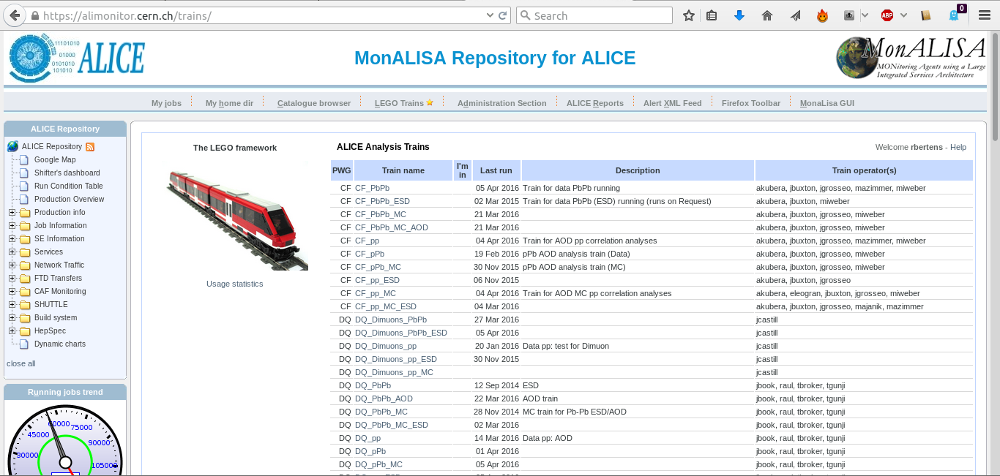

# The LEGO train system

By now, your code is running well on Grid, you're submitting and merging jobs like a seasoned professional. However, do you really want to 

* Stay up all night to resubmit jobs? 
* Risk losing your code because it's not committed to AliPhysics? 

To avoid these headaches, users are encouraged to run their jobs in a more automated and efficient way by using the LEGO framework. 

The LEGO framework is a tool to run and manage analysis trains on AliEn. It builds on existing infrastructure, the analysis framework, MonALISA and LPM. LEGO provides a web interface for users and operators which allows to:

*    register train wagons
*    configure trains (handlers, wagons, input datasets, global Variables)
*    test the wagons and the train in a well-defined environment
*    study the test results
*    submit the train to the Grid
*    study the resource consumption of the train for each wagon (CPU usage, virtual and resident memory) 

The fact that the trains run on the Grid, requires that all code is contained in an AliEn package. Therefore, the train uses the regularly deployed AliPhysics "AN" tags, so you will have to make sure that your analysis code is available in AliPhysics. Within AliPhysics, your analysis code will be part of a shared library that contains many other analyses from your working group or analysis group. If you have never added a class to AliPhysics, ask your PWG or PAG coordinators for help. 

The LEGO train system can be accessed via (https://alimonitor.cern.ch/trains/)

By clicking on the top right 'help' tab, you will be guided to a webpage where it is explained in detail how you can join a LEGO train and perform a highly efficient analysis. 


Everyone is encouraged to use the LEGO train system for running analysis rather than running analysis by yourself on Grid. Not only will you benefit yourself, but by but by running trains that contain analyses of multiple users in one go, we conserve resources: the LEGO train has to only run on instance of AliPhysics to perform multiple analyses, and it has to only retrieve the input data once. 

As a consequence: LEGO train jobs have *higher priority* in the job queues than user jobs! Furthermore, your analysis will always be reproducible, and you will receive a simple mail with a link to your final output file when your train run is done. So if you want to perform fast, safe, and efficient analysis: use the LEGO trains!

