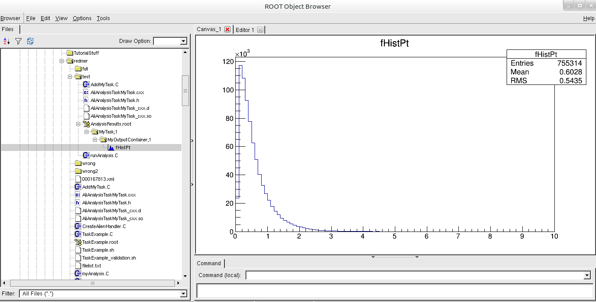

# Running locally
Now that we have seen how a task is built up, we will take a look at how you can run your analysis task. Basically, there are three options for running a task:

*  Run on **local** data

*  Run on **GRID** (either in test or full mode) yourself

*  Run on GRID using the **LEGO** train system

In this section, we will take a look at option 1: how to run on data that you have stored locally, on your own computer. To do this, we need to

* Compile our code, and
* Launch our analysis

To do so, we usually use another small macro, commonly referred to as a *steering macro*, which *steers* the analysis. This macro will create an analysis manager and data handler, will define which data files to run on, compile your code, and then instruct the analysis manager to run your analysis. An example of a steering macro to run the task `AliAnalysisTaskMyTask` on data that's stored on your laptop, looks as follows:


```cpp
    void runAnalysis() {
        // header location
        gROOT->ProcessLine(".include $ROOTSYS/include");
        gROOT->ProcessLine(".include $ALICE_ROOT/include");

        // create the analysis manager
        AliAnalysisManager *mgr = new AliAnalysisManager("AnalysisMyTask");
        AliAODInputHandler *aodH = new AliAODInputHandler();
        mgr->SetInputEventHandler(aodH);

        // compile the class (locally) with debug symbols
        gROOT->LoadMacro("AliAnalysisTaskMyTask.cxx++g");

        // load the addtask macro
        gROOT->LoadMacro("AddMyTask.C");

        // create an instance of your analysis task
        AliAnalysisTaskMyTask *task = AddMyTask();

        // if you want to run locally, we need to define some input
        TChain* chain = new TChain("aodTree");
        chain->Add("/scratch/.../AliAOD.root");

        // start the analysis locally
        mgr->StartAnalysis("local", chain);
    }
```

Read the above code snippet line-by-line, and try to understand the comments. 

## Running

To run your analysis, it will now suffice to type in a terminal (after sourcing the AliRoot environment): 
```
aliroot runAnalysis.C 
```

This will trigger executing of the steering macro, which will in turn launch the analysis. If all goes well, this minimal task should produce one histogram, which looks like



## Try for yourself? 

If you want to try this for yourself, you can now go through steps 1 through 5 of the 'Analysis tutorial exercises'.
