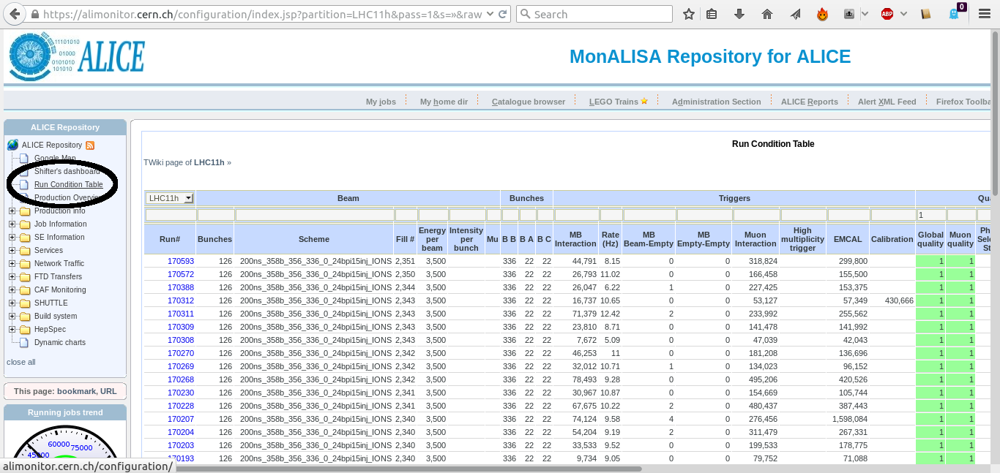
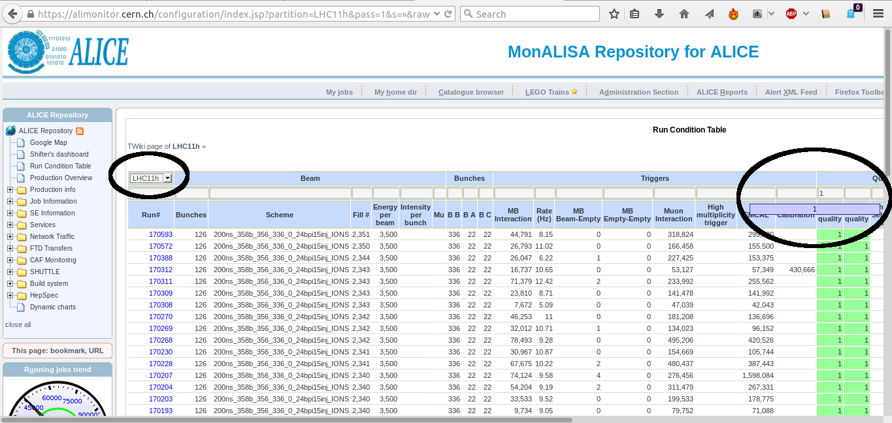
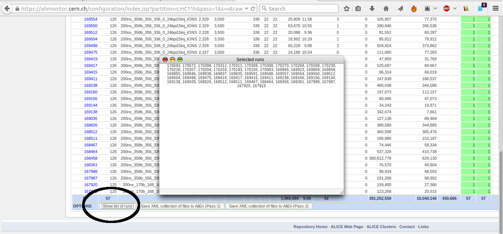
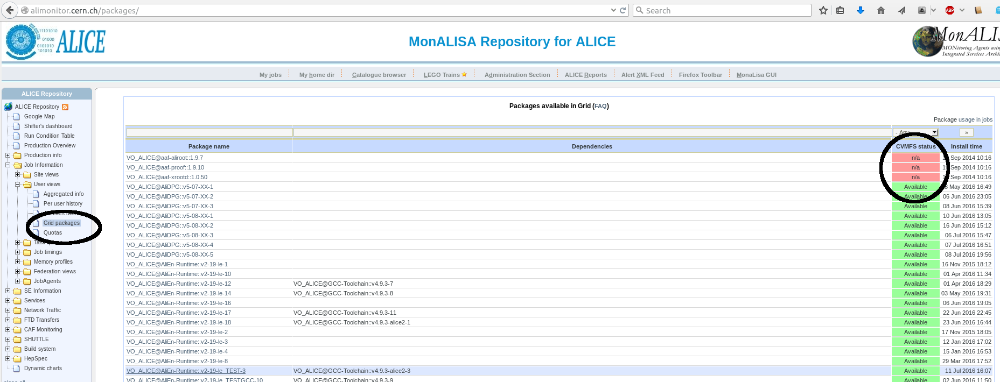
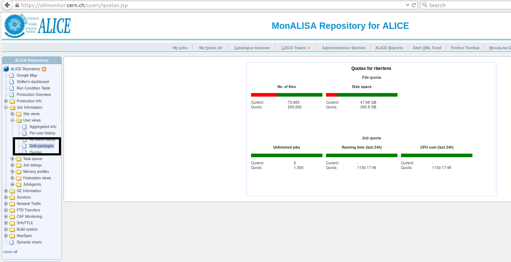

MonaLISA - the ALICE GRID monitoring toolset\
 \
{height=".3\textwidth"}
       {height=".3\textwidth"}\
 \
http://alimonitor.cern.ch/\
access with valid certificate and ALICE VO registration\
https://alien.web.cern.ch/content/vo/alice/userregistration

### Getting runnumbers from MonaLISA

{width="\textwidth"}

### Getting runnumbers from MonaLISA

{width="\textwidth"}\
check if your favorite **system** was taking **reliable** data!

### Getting runnumbers from MonaLISA

{width="\textwidth"}

### ... but then: which data to take ...?

You will find, for each run, data as

-   **AliESDs.root**: event summary data

-   **AliAOD.root**: analysis object data

in various **passes**\
**ESD** files contain **full** information about events

-   unless otherwise specified, use is **discouraged** as data are very
    large

**AOD** files contain information necessary for **physics analysis**

-   the preferred format for anaysis

-   **pre filtered** collections of tracks, to be selected via their
    filterbit\

**see previous talk!**\
**Passes**: over time we uderstand the experiment and data better

-   rule-of-thumb: take the **latest** (but discuss!)

### Available packages

only call ‘SetAliPhysicsVersion(“..”)’ in your run macro\
the right dependencies are automatically resolved
{width=".8\textwidth"}\
daily tags (AN) created at 16h ( available $\approx$2 hrs later)

### Run quota - how many jobs can you run?

if you’re over your quota, jobs won’t run\
{width=".8\textwidth"}\
be patient - quota are not all refreshed instantaneously (can take 12
hrs)
