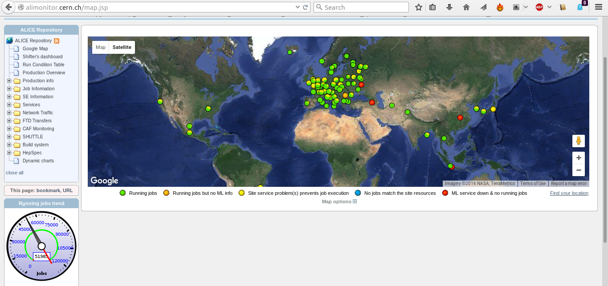

### GRID

{width="\textwidth"}

### But then there is GRID

{width="\textwidth"}

[Running your task on GRID]{}

-   Set up the Alien Enviroment in **runAnalysis**

    ``` {.numberLines .c language="C" numbers="left"}
    // create and configure the plugin
    AliAnalysisAlien *alienHandler = new AliAnalysisAlien();
    // also specify the include (header) paths on grid
    alienHandler->AddIncludePath("-I. -I$ROOTSYS/include -I$ALICE_ROOT -I$ALICE_ROOT/include -I$ALICE_PHYSICS/include");
    // make sure your source files get copied to grid
    alienHandler->SetAdditionalLibs("AliAnalysisTaskMyTask.cxx AliAnalysisTaskMyTask.h");
    alienHandler->SetAnalysisSource("AliAnalysisTaskMyTask.cxx");
    // select the aliphysics version. all other packages
    // are LOADED AUTOMATICALLY!
    alienHandler->SetAliPhysicsVersion("vAN-20160330-2");
    // select the input data
    alienHandler->SetGridDataDir("/alice/data/2011/LHC11h_2");
    alienHandler->SetDataPattern("*ESDs/pass2/AOD145/*AOD.root");
    // MC has no prefix, data has prefix 000
    alienHandler->SetRunPrefix("000");
    // runnumber
    alienHandler->AddRunNumber(167813);
    ```

[Running your task on GRID]{}

-   ... continued ...

    ``` {.numberLines .c language="C" numbers="left"}
    // number of files per subjob
    alienHandler->SetSplitMaxInputFileNumber(40);
    alienHandler->SetExecutable("myTask.sh");
    // specify how many seconds your job may take
    alienHandler->SetTTL(10000);
    alienHandler->SetJDLName("myTask.jdl");
    |\pause|
    alienHandler->SetOutputToRunNo(kTRUE);
    alienHandler->SetKeepLogs(kTRUE);
    // merging: run with kTRUE to merge on grid
    // after re-running the jobs in SetRunMode("terminate") 
    // (see below) mode, set SetMergeViaJDL(kFALSE) 
    // to collect final results
    alienHandler->SetMaxMergeStages(1);
    alienHandler->SetMergeViaJDL(kTRUE);

    // define the output folders
    alienHandler->SetGridWorkingDir("myWorkingDir");
    alienHandler->SetGridOutputDir("myOutputDir");
    ```

[Test or full mode ? ]{}

-   The GRID analysis can run in **full** or **test** mode

        // connect the alien plugin to the manager
        mgr->SetGridHandler(alienHandler);
        if(gridTest) {
            // speficy on how many files you want to run
            alienHandler->SetNtestFiles(1);
            // and launch the analysis
            alienHandler->SetRunMode("test");
            mgr->StartAnalysis("grid");
        } else {
            // else launch the full grid analysis
            alienHandler->SetRunMode("full");
            mgr->StartAnalysis("grid");
        }

-   Test mode **simulates** a GRID environment locally for testing

-   Full mode launches your jobs to GRID

[Launching your task on GRID]{} Not different from local running, but
make sure you have a valid **token**

    [rbertens@degobah ~]$ alien-token-init rbertens
     ...
    => Trying to connect to Server [0] root://pcapiserv03.cern.ch:10000 as User rbertens 
    ...
    Creating token ..................................... Done
    Your token is valid until: Thu Apr  7 15:23:52 2016

and you’re good to go

    [rbertens@degobah test]$ aliroot runAnalysis.C 

In the end, you have still to **merge** your output to get it locally

### Merging output on GRID

The easiest way to merge your output is using the ‘MergeViaJDL’ option

[When you launch your jobs (in ‘runAnalysis.C’)]{}

    alienHander->SetMergeViaJDL(kTRUE);
    alienHander->SetMaxMergeStates(1);  // just one step
    ....
    mgr->SetRunMode("full");

[When all your jobs are in [done]{} [($\leftarrow$ never use green on
slides!)]{}]{}

    alienHander->SetMergeViaJDL(kTRUE);
    alienHander->SetMaxMergeStates(1);  // just one
    ....
    mgr->SetRunMode("terminate");

and run ‘runAnalysis.C’ again - this launches **merging** jobs\
$\longrightarrow$ *I’ll tell later where you can monitor the progress of
your jobs!*

### Merging output on GRID

When all your **merging** jobs are in [done]{}

[Retrieve the final output]{}

    alienHander->SetMergeViaJDL(kFALSE);
    alienHander->SetMaxMergeStates(1);  // just one
    mgr->SetRunMode("terminate");

and run ‘runAnalysis.C’ a final time

This will trigger

-   Downloading of the merged output files

-   A final ‘local’ merge of said files

When the process is **done** your high-statistics output files is ready

**caveat** - merging is ‘dumb’

-   files are kept in memory while merging

-   large outputs might need multiple stages
