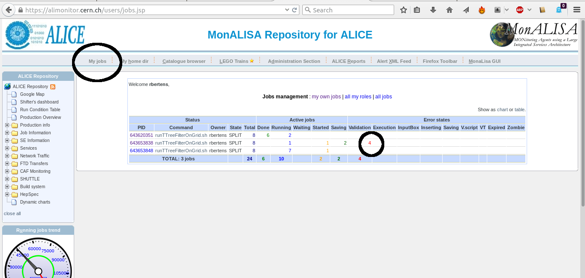
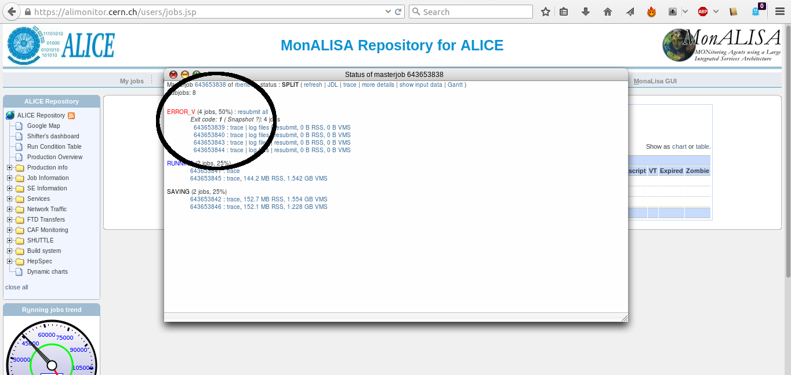
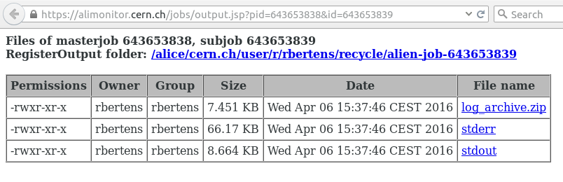
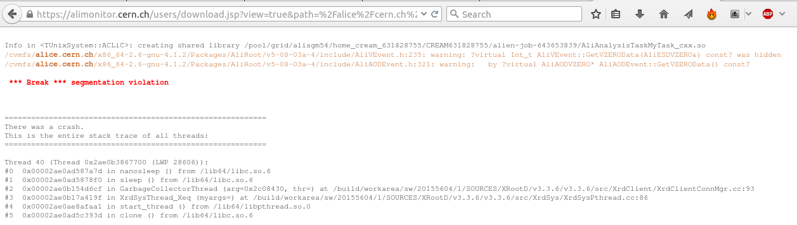
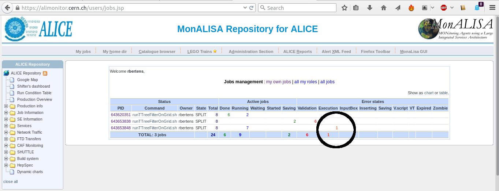
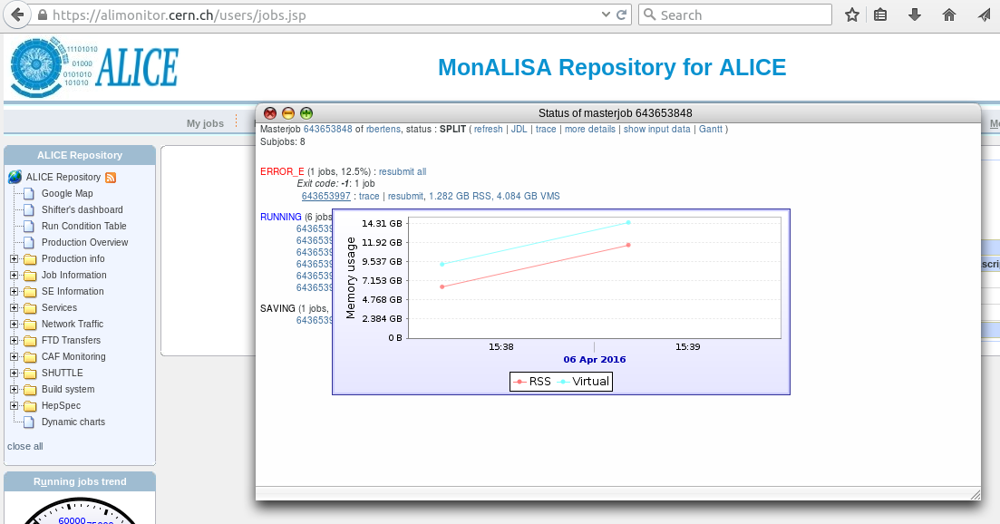
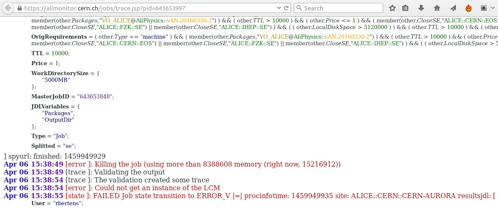

# Troubleshooting - when Grid does not do what you want it to do

Sometimes, running jobs does not go as smoothly as you would like it to go. In this section, we will cover some basic troubleshooting. 

## First off all: be informed!
Grid operations are complex. Often, job failures are a result of mistakes of users, but sometimes, certain Grid sites experience general problems. To quickly resolve these problems, it is important that we clearly communicate problems. To do so, ALICE makes extensive use of mailing lists. You can self-subscribe to mailing lists pertaining to Grid operations by surfing to **e-groups.cern.ch** . There, make sure that you are subscribed to
-   alice-analysis-operations
-   alice-project-analysis-task-force
-   your PAG’s mailing list

ALICE also employes a more professional bug and feature tracking suite, called *JIRA*, which you can access via
-   https://alice.its.cern.ch/jira/projects/ALPHY

## Troubleshooting 101 - what should you do? 
Sometimes, you will see mails such as

                `Dear experts,
            All my jobs are going into error. 
                Could you check? Thanks!'
            
being sent to the mailing lists. The experts **can** (and probably will) check, but you yourself should
be the **first** to take a look at why your job is not doing what you want it to do. The starting point is

-   Go to ‘**my jobs**’ on MonaLISA
-   Take a look at the job **trace** and, if available, the **stderr**
    and **stdout**

The trace tells you exactly how your job was handled, from copying of files to Grid nodes, to executing the job, to checking if the expected output files were actually created. Stdout and stderr are the standard handles for the normal information and error information. Depending on whether or not the process actually ran, these files may or may not be available. 

If you have checked your job's trace, stdout and stderr, and still cannot solve an issue, it is completely fine to write a mail to the mailing list. However, be *complete* in your message, specify *what* goes wrong, and provide some examples of *job numbers*. Do not kill your jobs! If the jobs are purged from the queue, debug information is lost. 


Heads-up: excellent **actual debugging** documentation is available at
-   https://dberzano.github.io/alice/debug/



### Example: validation error
Let's take a look at an example of troubleshooting. We have some jobs running, and check their progress on MonALISA. Unfortunately, we see that *all* of our subjobs, corresponding to a given masterjob, go into the error state 'Validation error'


The first thing to do, is click on the masterjob number, to get a detailed overview of the subjobs. This table allows us access to the trace and log files


Clicking on 'log files' leads us to a page where we can consult the log files


and by e.g. clicking on the 'stderr', we can check the error information of our job. 


Mmm, so the job crashed with a segmentation violation, and if we remember correctly from our programming classes, we know that this points at illegal memory access ... so we had better go to our analysis code, and check our pointers ....


Below, we see the `UserCreateOutputObjects` and a snippet of the `UserExec()` methods of the task that ran and segfaulted. What is wrong ? 

```cpp
    AliAnalysisTaskMyTask::UserCreateOutputObjects()
    {
        // create a new TList that OWNS its objects
        fOutputList = new TList();
        fOutputList->SetOwner(kTRUE);
        // add the list to our output file
        PostData(1,fOutputList);
    }
       ...
    AliAnalysisTaskMyTask::UserExec() {
       // called for each event
       ...
       fHistPt->Fill(track->Pt());
```

We forgot to initialize the histogram that we try to fill: the pointer `fHistPt` has value NULL


## Example: execution error
Let's take a look at another example. We are again running our jobs, but now we notice that subjobs of a given masterjob start to go into an 'Execution error' state. 



Again, after clicking on the masterjob ID, the popup window of subjobs opens. If we hover with the mouse over the ID of a certain subjob, an graph of memory usage over time is shown. In this particular case, we clearly see that memory usage increases linearly over time



Let's click on the trace of the subjob


From the trace, we see that the job was killed because it used too much memory. The fact that we saw that the memory consumption increased linearly over time, probably means that there is a memory leak somewhere in our code ... better go back to the drawing board. 

## What is the perfect workflow?
By now, we have seen that we can run our analysis
* locally, on some data on our laptop
* on Grid, either in test mode or full mode
* on the LEGO trains

Even though there is **no** perfect workflow, it is generally wise to
-   Download some AliAOD.root files to your computer
-   Develop your task
-   Test locally (fast, no internet connection needed)

When this goes well
-   Check in ‘test’ grid mode. There are a few subtle differences
    between running LOCALLY and on GRID (covered in the next section)

If the code is robust:
-   Don’t spend long nights (re)submitting jobs to GRID ...
-   ... rather get your code checked into AliPhysics
-   **And use the LEGO trains**
