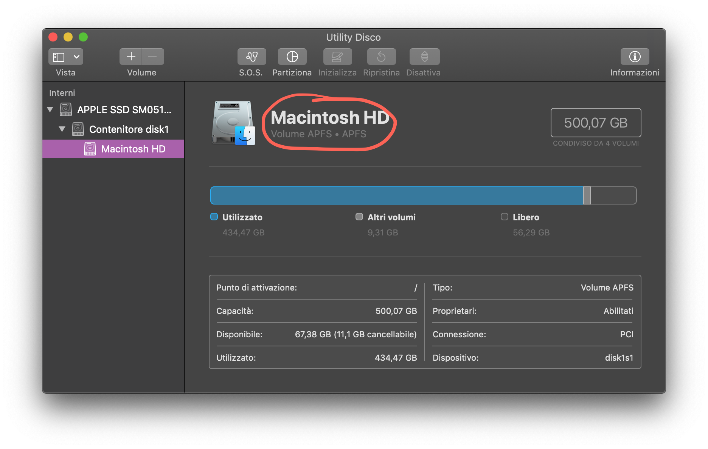
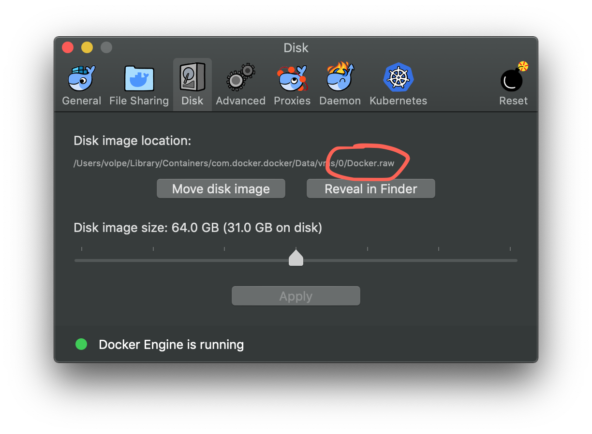
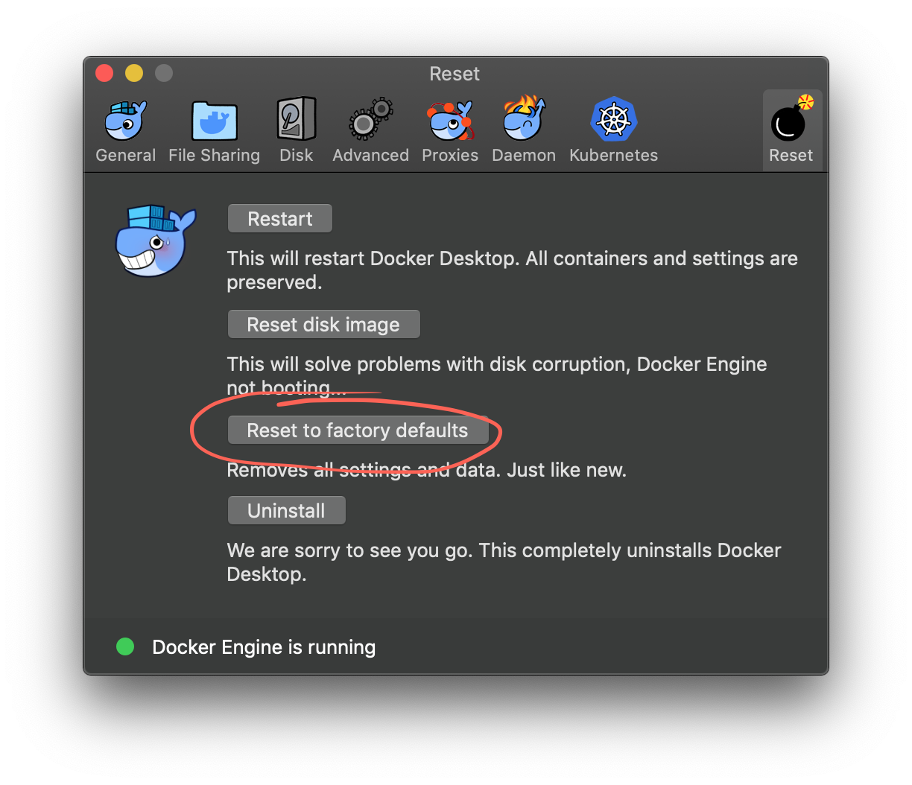
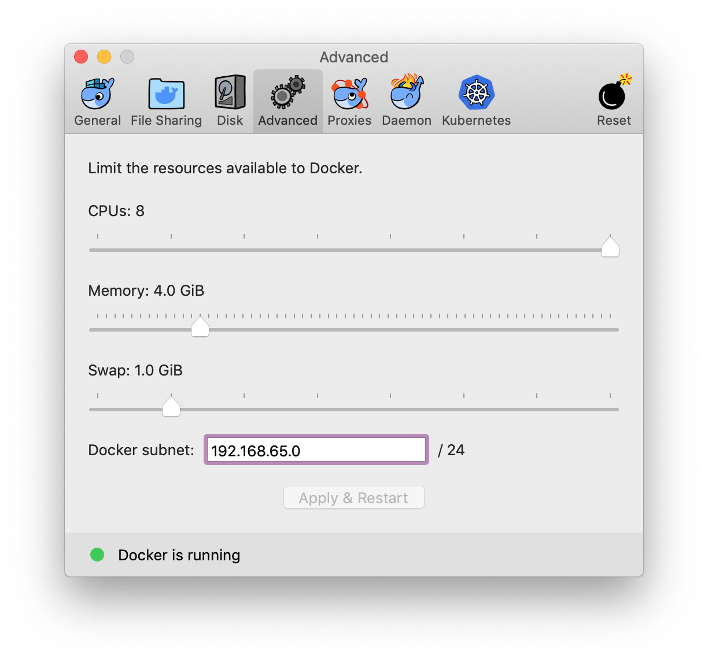

# 🐳 Using alidock

[](https://badge.fury.io/py/alidock)

[alidock](https://github.com/alidock/alidock) is our way to provide users with a consistent
environment and precompiled builds. It is our recommended way to install and use ALICE software on
your computer as it makes support and your life easier.


[alidock](https://github.com/alidock/alidock) is a community-supported tool based on Docker. It
ultimately launches a Docker container currently based on the [ALICE officially supported CERN
CentOS 7](https://hub.docker.com/r/alisw/slc7-builder) environment. Its support model is similar to
popular tools like [nittygriddy](https://github.com/alice-contrib/nittygriddy/).

Support for alidock is done through [opening an issue on its GitHub
repository](https://github.com/alidock/alidock/issues).

What ALICE [officially
recommends](https://indico.cern.ch/event/642232/#3-wp3-common-tools-and-softwar) is the use of the
CERN CentOS 7 operating system. If for some reason you do not want to use alidock, you can still
profit from this guide to configure Docker on your system, and then you can launch the official
image manually:

```bash
docker run -it alisw/slc7-builder
```

This will be an ordinary CC7 environment so the [custom installation rules](custom.md) apply.



Install Docker
--------------

Docker has some [extensive documentation](https://docs.docker.com/install/) covering the
installation.


### 🐧 Linux post-installation

By default, `docker` does not run as non-privileged user. You need to add your user to the `docker`
group. Follow [the instructions here](https://docs.docker.com/install/linux/linux-postinstall/): it
should be sufficient to run:

```bash
sudo groupadd docker           # create docker group
sudo usermod -aG docker $USER  # add me to the docker group
```

You need to log out and log back in for the group settings to be effective.


### 🍏 macOS post-installation

On macOS, Docker runs in a lightweight virtual machine. There is some fine tuning to do once for all
for making it work at a reasonable speed.

First off, you should make sure you are running at least macOS High Sierra, and your main disk's
filesystem is APFS (not supported by earlier versions of macOS). Check your filesystem by opening
the **Disk Utility** application. Your main disk (whose name is **Macintosh HD** by default) should
report APFS as filesystem:

<center></center>

_⚠️ Your disk should have been converted automatically to APFS during your High Sierra installation if
possible. If this did not happen, you will still be able to use Docker, but it will be slower._

Start the Docker app now. A Docker icon will appear in the menu bar. Click on it, then click
**Preferences...** on the menu, and select the **Disk** tab. Look at the **Disk image location**:
the filename must end with `.raw` and not with `.qcow2`, as in the picture below:

<center></center>

If the extension is `.qcow2`, and your disk is APFS, you need to reset your Docker installation to
factory settings by clicking the **Reset** bomb, and then the **Reset to factory defaults** button:

<center></center>

_⚠️ You will lose your Docker volumes, if any, so beware. If you have a recent operating system with
a solid state drive, and your installation of Docker is fresh, you probably don't need this step._

Docker runs in a lightweight virtual machine with not so many resources allocated to it by default.
Click now the **Advanced** tab and you will see the following window:

<center></center>

Set the number of CPUs to the maximum allowed by your Mac, and at least 4 GiB of memory. You may
want to add even more memory in case you have troubles running some software.

You need to press the **Apply & Restart** button to apply the settings.

Graphical applications in the container will require [XQuartz](https://www.xquartz.org/) installed
on your Mac. Go to their [website](https://www.xquartz.org/), download the most recent package, and
install it.

_⚠️ Logging out and back in again is required after the installation._

Test if it works by opening a terminal and typing `xcalc`. An ugly calculator should pop up.


Get alidock
-----------

[alidock](https://pypi.org/project/alidock/) is available as a PyPI package. Get it with:

```bash
bash <(curl -fsSL https://bit.ly/alidock-installer)
```

The installation will refuse to continue in case your Docker installation does not work. You will have
to fix it first by following [these steps](#install-docker). At the end of the installation
you may be advised to **open a new terminal** in order to use it.

alidock self-updates automatically whenever a new stable release is out! 🎉


Use the alidock environment
---------------------------

Just type:

```bash
alidock
```

and you will have a shell inside your custom environment. This is how your prompt looks like when
you are inside alidock:

```
[alidock] ~ $>
```

The first time you run it, a new container will be created. Subsequent runs will open new shells in
the same container. You can run `alidock` as many times you want.

Your container's home directory is called `/home/alidock` and it is also visible from outside the
container as `~/alidock`. This means that your data will not be lost when you stop the container,
and you will be able to use your favourite graphical editor _from outside_ the alidock environment.

The container stays running in the background. If you don't need it any longer, you may want to stop
it (as said, your data will not be lost):

```bash
alidock stop
```


Build software from within alidock
----------------------------------

alidock comes with [aliBuild](https://alisw.github.io/alibuild) preinstalled and configured. You do
not need to install it. Furthermore, whenever alidock updates the base image, it will also get the
newest aliBuild version, if any.

You can follow the following instructions for building the packages in an alidock session.
Remember, you are in an alidock session if you see `[alidock]` at your prompt.

* [🛠 Build the packages](build.md)


Housekeeping
------------

Docker and the container directory may get very large in size. From time to time, you may want to
do some housekeeping.


### Clean up old containers

Docker has a command to perform a cleanup of unused space. Run it from _outside_ the container:

```bash
docker system prune -f
```

alidock will suggest you to run it whenever the container image is updated.


### Clean up old builds

You may want to run, within an alidock session:

```bash
aliBuild clean --aggressive
```

to clean up temporary space.


### Manual and thorough cleanup

aliBuild caches some stuff under `~/.sw` from inside the container. You can cleanup your
installation completely by running, from within an alidock session:

```bash
cd ~/.sw
shopt -s extglob       # enable shell negative matches
echo rm -rf !(MIRROR)  # remove all except MIRROR
```

`~/.sw/MIRROR` is the place where all the source code of all the packages is stored. **You don't
want to remove it, ever:** if you keep it, you will save lots of time during subsequent builds.


### Share MIRROR from your laptop

Do you have a previous aliBuild installation on your laptop? Do you want to migrate your current
aliBuild installation? You already have the `MIRROR` directory somewhere on your laptop.

If you have followed [the manual instructions](custom.md), this directory is called:

```
$ALIBUILD_WORK_DIR/MIRROR
```

From _outside_ the container, do the following: first off, move your current `MIRROR` directory
inside the container:

```bash
mkdir -p ~/alidock/.sw
rm -rf ~/alidock/.sw/MIRROR  # if it exists already, get rid of it and use the laptop's
mv $ALIBUILD_WORK_DIR/MIRROR ~/alidock/.sw/MIRROR
```

then link it to the old location:

```bash
ln -nfs ~/alidock/.sw/MIRROR $ALIBUILD_WORK_DIR/MIRROR
```

This will allow your laptop installation and your container installation to share the same mirror
directory.

**⚠️  Your laptop directory will link the container's directory. The opposite will not work.**


### macOS: exclude .sw from backup and indexing

Your `.sw` directory contains disposable data that already exists in remote repositories, plus it
gets very big. alidock automatically excludes this directory from your Time Machine backups and
Spotlight indexing.
