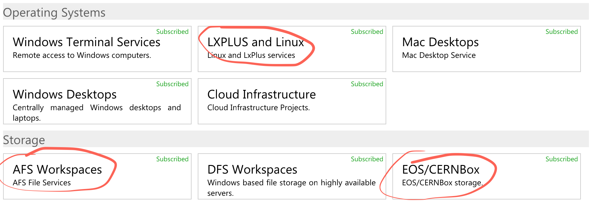

Getting started in ALICE
========================

## Are you a registered ALICE member?

Use [this link](https://alisw.cern.ch/check) to check if your CERN account is connected to ALICE. In
case you see a message saying that you are not an ALICE member, you need to fix the problem: many
services are not accessible if you are not considered an ALICE member.

Drop an email to the ALICE Secretariat, they will help you: <alice.secretariat@cern.ch>


## Do you have access to lxplus?

When you have a CERN account you can typically login to lxplus via SSH:

```bash
ssh USERNAME@lxplus.cern.ch
```

If, in spite of providing the correct password, you are not allowed to connect, go on your [CERN
account management page](https://cern.ch/account). You need to **Sign in** and to select **Resources
and Services** like in the picture below:

<center></center>

Then click the big **List Services** button and check if the following services are enabled for you:

<center></center>

You need:

* LXPLUS and Linux
* AFS Workspaces
* EOS/CERNBox

In case some of them are missing, just click on the service to subscribe. For Linux, you may be
requested to provide a "group" and a "reason" for requesting the subscription.

* **Group:** `z2` (it corresponds to ALICE)
* **Reason:** just type something like "new ALICE member", it's enough

It will take _at least_ two full working hours before you will be able to use the services


## Using the Grid: get a certificate

The procedure for getting or renewing a certificate is illustrated [here](./cert.md).


## Requesting support

There are different ways to request support in ALICE. For simple requests concerning Run 2 software
there are two mailing lists:

* General questions on analysis, build problems, etc.: <alice-project-analysis-task-force@cern.ch>
* Problems with jobs submission, certificates, trains: <alice-analysis-operations@cern.ch>

You can self-subscribe to them if you are an [ALICE member](#are-you-a-registered-alice-member). Go
to the [CERN egroups](http://egroups.cern.ch) page, search for the group name, click on it and then
you will be presented with an option to subscribe. You can unsubscribe using the same procedure.

Support for Run 3 does not rely on mailing lists. We are using [Discourse](https://discourse.org):

* [ALICE Talk](https://alice-talk.web.cern.ch)

We also use Mattermost for direct messages or public groups (seek support in the Town Square)

* [The ALICE Mattermost team](https://mattermost.web.cern.ch/alice/)

For reporting actual bugs and track progress of important development, we use
[Jira](https://www.atlassian.com/software/jira):

* [The ALICE Jira](https://alice.its.cern.ch/)


